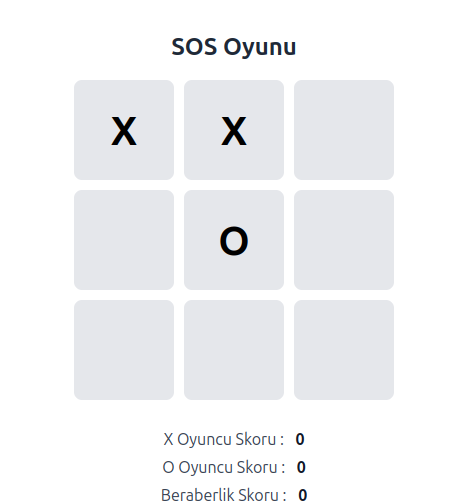

# TR
# SOS Oyunu (Tic-Tac-Toe)
İki oyunculu, tarayıcı tabanlı klasik X-O oyunu. Skorlar localStorage'a kaydedilir; sayfa yenilendiğinde bile puan tablosu korunur.

## Canlı Önizleme

[Proje Önizlemesi](https://dursunkokturk.github.io/JavaScript-Project-SOS-Game/)

## Özellikler

- İki Oyunculu Mod — X ve O oyuncuları sırayla 3x3 ızgaraya tıklar
- Kazanma Tespiti — 8 olası kombinasyon kontrol edilir; kazanan alert ile duyurulur
- Beraberlik Tespiti — Tüm kareler dolduğunda ve kazanan yoksa beraberlik ilan edilir
- Skor Takibi — X, O ve beraberlik puanları ekranda anlık güncellenir
- localStorage Kalıcılığı — Skorlar tarayıcıya kaydedilir; sayfa yenilense de kaybolmaz
- Yeniden Oyna — Tahta temizlenir, sıra X'e döner; skorlar korunur
- Skorları Sil — Tüm puanlar sıfırlanır ve localStorage güncellenir
- Hover Animasyonları — Kare ve buton üzerine gelindiğinde ölçek ve renk efektleri

## Nasıl Oynanır?

- X oyuncusu boş bir kareye tıklar
- Sıra O oyuncusuna geçer
- Aynı hizada (yatay, dikey veya çapraz) üç aynı sembolü getiren oyuncu kazanır
- Tüm kareler dolup kazanan çıkmazsa oyun berabere biter
- Yeni oyun için Yeniden Oyna, skorları temizlemek için Skorları Sil butonuna basılır

## Teknolojiler

| Teknoloji  | Açıklama                                      |
| ---------- |-----------------------------------------------|
| HTML5      | Semantik sayfa yapısı                         |
| CSS3       | Grid, Flexbox, transition animasyonları       |
| JavaScript | Oyun mantığı, DOM manipülasyonu, localStorage |

### Proje Yapısı
sos-game/  
├── index.html  
└── assets/  
    ├── css/  
    │   └── style.css  
    └── js/  
        └── sos-game.js  

### Uygulama Akışı
Sayfa Açılır  
    │  
    ▼  
localStorage'da "sosScores" var mı?  
    │  
    ├── Evet  → Skorlar localStorage'dan yüklenir  
    │  
    └── Hayır → Skorlar 0 olarak ayarlanır ve localStorage'a yazılır  
                       │  
                       ▼  
               Oyun Başlar (currentPlayer = "X")  
                       │  
                       ▼  
               Kareye Tıklanır → X/O yazılır → Kazanan/Beraberlik kontrolü  
                       │  
              ┌────────┴────────┐  
           Kazanan            Beraberlik  
           Skoru artar        Beraberlik skoru artar  
           Oyun durur         Oyun durur  

## Kurulum
Proje herhangi bir bağımlılık gerektirmez.
bash# Repoyu klonlayın
git clone https://github.com/kullanici-adi/sos-game.git

### Proje klasörüne girin
cd sos-game

### index.html dosyasını tarayıcıda açın
open index.html

#### Not: sos-game.js dosyası defer ile yüklenir; DOM tamamen hazır olduktan sonra çalışır.

## Tasarım Detayları

- Renk Paleti:

    - #2563eb — Mavi (butonlar, X oyuncu rengi)
    - #ef4444 — Kırmızı (O oyuncu rengi)
    - #e5e7eb — Açık gri (kare arka planı)
    - #f3f4f6 — Çok açık gri (sayfa arka planı)
    - #1f2937 — Koyu (başlık metni)

- Font: system-ui, Arial, Helvetica
- Izgara: CSS Grid ile 3x3, her kare 100x100px
- Kart Efekti: Hover'da scale(1.05) ve translateY(-2px) animasyonları

# EN
# SOS Game (Tic-Tac-Toe)
A two-player, browser-based classic X-O game. Scores are saved to localStorage and the scoreboard persists even after page refreshes.

## Live Preview
[Project Preview](https://dursunkokturk.github.io/JavaScript-Project-SOS-Game/)

## Features

- Two-Player Mode — X and O players take turns clicking on the 3x3 grid
- Win Detection — 8 possible combinations are checked; the winner is announced via alert
- Draw Detection — A draw is declared when all squares are filled with no winner
- Score Tracking — X, O, and draw scores update in real time on screen
- localStorage Persistence — Scores are saved to the browser and survive page refreshes
- Play Again — Clears the board and returns the turn to X; scores are preserved
- Clear Scores — Resets all points and updates localStorage
- Hover Animations — Scale and color effects on squares and buttons

## How to Play

- The X player clicks on an empty square
- The turn passes to the O player
- The player who gets three matching symbols in a row (horizontal, vertical, or diagonal) wins
- If all squares are filled with no winner, the game ends in a draw
- Press Play Again for a new game, or Clear Scores to reset the scoreboard

## Technologies

| Technology | Description                                |
| ---------- |--------------------------------------------|
| HTML5      | Semantic page structure                    |
| CSS3       | Grid, Flexbox, transition animations       |
| JavaScript | Game logic, DOM manipulation, localStorage |

## Project Structure
sos-game/  
├── index.html  
└── assets/  
    ├── css/  
    │   └── style.css  
    └── js/  
        └── sos-game.js  

## Application Flow
Page Loads  
    │  
    ▼  
Does "sosScores" exist in localStorage?  
    │  
    ├── Yes  → Scores are loaded from localStorage  
    │  
    └── No   → Scores set to 0 and written to localStorage  
                       │  
                       ▼  
               Game Starts (currentPlayer = "X")  
                       │  
                       ▼
               Square Clicked → X/O written → Win/Draw check  
                       │  
              ┌────────┴────────┐  
           Winner             Draw  
           Score increases    Draw score increases  
           Game stops         Game stops  

## Installation
The project requires no dependencies.
bash# Clone the repo
git clone https://github.com/username/sos-game.git

### Navigate to the project folder
cd sos-game

### Open index.html in the browser
open index.html

#### Note: sos-game.js is loaded with defer and runs only after the DOM is fully ready.

## Design Details
- Color Palette
  - #2563eb — Blue (buttons, X player color)
  - #ef4444 — Red (O player color)
  - #e5e7eb — Light gray (square background)
  - #f3f4f6 — Very light gray (page background)
  - #1f2937 — Dark (heading text)

- Font: system-ui, Arial, Helvetica
- Grid: 3×3 with CSS Grid, each square 100×100px
- Card Effect: scale(1.05) and translateY(-2px) animations on hover
